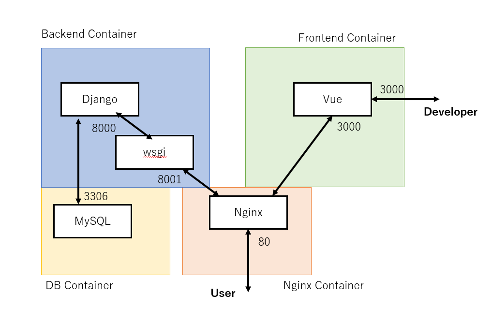

# Vue-django Based Blog

This is an SPI blog developed using Vue and Django. This blog is developed using Docker, so it runs easily on the environment at hand.

# Features

   ## Configration Diagram

  

  ## Description

   - Backend

  The backend is implemented with [Django Rest Framework](https://github.com/encode/django-rest-framework), an API that communicates with Nginx using wsgi (port number 8001) and exchanges data in JSON format.

   - Frontend

  The frontend is implemented using [Vue](https://github.com/vuejs/vue). [Vite](https://github.com/vitejs/vite) is used as the build tool to speed up hot reloading; hot reloading does not work when accessing from port 80, so developers should connect to port 3000 for development.

  ( Vue does not support SSR, which may result in disadvantageous SEO in search engines. Therefore, we plan to migrate to [Nuxt.js](https://github.com/nuxt/nuxt.js). We will also migrate to Typescript as needed. )

   - Database
   
  The database is implemented using MySQL, which handles data exchange with the Django REST API. To develop, please refer to the .env.sample to set up the MySQL server username and password, and create the .env file in the same hierarchical directory.

   - Web Server
   
   The Web Server uses Nginx to realize a reverse proxy, allowing the frontend (Vue) and backend (Django) to work together in response to requests from port 80.

# Requirement

This application is developed using [Docker](https://www.docker.com/); Windows or Mac users should install Docker Desktop. Click [here](https://docs.docker.com/engine/install/) for installation instructions.

# Installation

1. Clone this repository:
```
git clone https://github.com/GinKuReNai/vue-django-blog.git
```

1. Change directory and make docker image:
```
cd vue-django-blog
docker compose build
```

1. Deploy Vue:
```
docker compose run frontend npm run build
```

1. Start docker containers:
```
docker compose down
docker compose up -d
```

1. Move to the backend container and perform ORM migration:
```
docker compose exec backend bash
python3 manage.py makemigrations
python3 manage.py migrate
```

1. Collect static files in the backend container:
```
python3 manage.py collectstatic.
```

If you encounter errors during migration, such as database tables not being found, go to the database container and execute the following commands:
```
docker compose exec db bash
mysql -u <username> -p
drop database blog_data;
create database blog_data character set utf8;
```

# Usage

- Home
[http://localhost/](http://localhost/)
- Development Server
[http://localhost:3000/](http://localhost:3000/)
Access to hot reloading to check changes as they occur.

- Admin Site (Django)
[http://localhost/admin/](http://localhost/admin/)
Access this page to use the blog's administration screen to post and edit articles, add tags and categories, etc.

- REST Api
[http://localhost/api/](http://localhost/api/)
Access the API to check the input/output of JSON format objects or to check the REST functionality of the API.

# Note

Feel free to modify the frontend implementation.

# Author

Akito Koga

# License

The source code is licensed MIT. The website content is licensed CC BY 4.0,see LICENSE.
